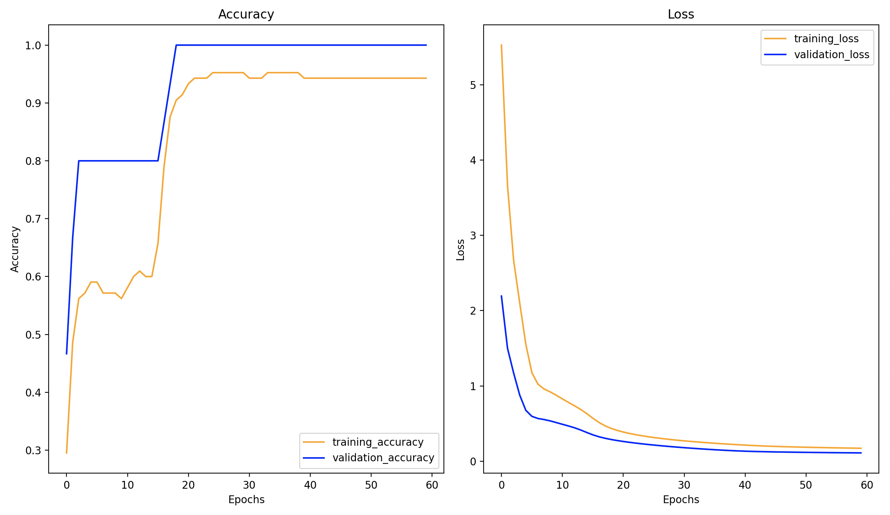

# Solving classification problems
___
Purpose of this project is solving basic machine learning classification problems without using any third-party libraries or frameworks (Tensorflow, PyTorch etc). Dataset I used was [Iris dataset](https://scikit-learn.org/stable/auto_examples/datasets/plot_iris_dataset.html), you can visit this page to get brief introduction of this simple dataset.
___
## Logistic Regression

Solving this problem requires two ways of implementation, based on output (if its binary or multiclass classification). After 1000 epochs, and learning rate of 0.01, algorithm accuracy is about 96%.

___
## Neural Network

Requires little bit more complex neural network to get 100% accuracy. 3 layers, with 128, 64, 3 neurons in each layer.

